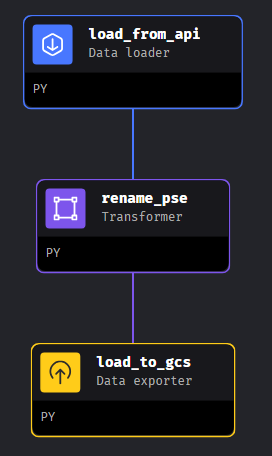

# Philippine Stock Exchange Analysis

## Project Overview

The Philippine Stock Exchange (PSE) is a vital component of the country's financial landscape, offering investors a platform to trade equities, bonds, and other securities. This project aims to conduct comprehensive analytics on PSE data to derive insights, trends, and patterns that can inform investment strategies, risk management decisions, and market behavior understanding.

### Architecture


This project will design and implement an ETL (Extract, Transform, Load) pipeline using a suite of modern data engineering technologies. The pipeline will automate the extraction of data from various sources, transform it into a usable format, and load it into a cloud-based data warehouse for analysis. By leveraging these technologies, this aims to streamline data processing workflows, ensure data integrity, and enable efficient analytics and reporting.

## Dataset

The dataset is sourced from Kaggle, focusing on OHLCV (Open, High, Low, Close, Volume) stock data from the Philippines Stock Exchange. This dataset provides historical market information, including price movements and trading volumes for various stocks listed on the exchange. With this data, we aim to analyze trends and patterns to better understand the dynamics of the Philippine stock market

### Columns

| Field  | Description                        |
|--------|------------------------------------|
| c      | Closing price                      |
| h      | Highest price within the day       |
| l      | Lowest price within the day        |
| o      | Opening price                      |
| t      | Time of the last trade             |
| v      | Volume                             |
| y      | Dividend yield                     |
| m      | month                              |
| d      | day                                |
| w      | week                               |
| wd     | day of the week                    |
| last   | Last trade price                   |
| change | Change in price                    |
| pchange| Percentage change in price         |
| symbol | Stock symbol                       |

The column names listed will undergo transformation using tools like Mage and DBT Cloud. This process involves assigning appropriate data types to ensure data consistency and accuracy. Additionally, some columns may be removed during cleanup to enhance data cleanliness, removing redundancies or irrelevant information. These steps aim to optimize the dataset for further analysis and visualization, facilitating meaningful insights and decision-making.

## Technologies Used

- **Mage:**
  - Open-source data pipeline tool for transforming and integrating data.

- **Docker:**
  - Containerization platform for packaging applications and dependencies.

- **Terraform:**
  - Infrastructure as code (IaC) tool for provisioning and managing cloud resources.

- **dbt (Data Build Tool):**
  - Analytics engineering tool for transforming and modeling data in the cloud data warehouse.

- **Google Cloud Storage and BigQuery:**
  - Cloud storage and data warehousing solutions for storing and analyzing large datasets.

- **Google Data Studio:**
  - Visualization and reporting tool for creating interactive dashboards and reports.

## Run the Pipeline

### Prerequisites

Before you can start working with this project, ensure you have the following prerequisites installed and set up:

### 1. Google Cloud Platform (GCP) Account

You'll need a GCP account to use Google Cloud services such as Google Cloud Storage, BigQuery, and Data Studio. If you don't have a GCP account, you can sign up for free [here](https://cloud.google.com/free).

### 2. Terraform

Terraform is used for provisioning and managing cloud infrastructure.

#### Installation Instructions:

- Download the appropriate Terraform package for your operating system from the [official website](https://www.terraform.io/downloads.html).
- Extract the downloaded package and add the Terraform binary to your system's PATH.
- Verify the installation by running `terraform --version` in your terminal.

### 3. Docker

Docker is a containerization platform used for packaging applications and dependencies.

#### Installation Instructions:

- Install Docker Desktop for your operating system by following the instructions in the [official documentation](https://docs.docker.com/get-docker/) or from [DE ZOOMCAMP](https://github.com/DataTalksClub/data-engineering-zoomcamp).
- Once installed, verify Docker installation by running `docker --version` in your terminal.

### 4. dbt (Data Build Tool)

dbt is an analytics engineering tool used for transforming and modeling data in the cloud data warehouse.

#### Installation Instructions:

- Install dbt by following the instructions in the [official documentation](https://docs.getdbt.com/dbt-cli/installation) or from [DE ZOOMCAMP](https://github.com/DataTalksClub/data-engineering-zoomcamp).
- Verify the installation by running `dbt --version` in your terminal.

### 5. Mage

Mage is an orchestration tool used for managing and scheduling data pipelines.

#### Installation Instructions:

- Install Mage by following the instructions in the [official documentation](https://docs.mage.ai/introduction/overview) or from the [Mage Zoomcamp](https://github.com/mage-ai/compose-quickstart).
- Choose the installation method that best suits your environment (e.g., using pip, Docker, or using a pre-packaged installation).

### After installing all the prerequisites, follow these steps.

1. **Clone the Repository**: Clone this repository to your local machine using the following command:
    ```bash
    git clone https://github.com/MisterArco/PSE-Analysis.git
    ```

2. **Set Up GCP Authentication**: Configure authentication for Google Cloud Platform by following the instructions [here](https://cloud.google.com/docs/authentication/getting-started).

3. **Initialize Terraform**: Navigate to the `terraform` directory and initialize Terraform by running the following command:
    ```bash
    terraform init
    terraform plan
    terraform apply
    ```

    This will create all the datasets that you need in order to run the pipeline.

5. **Build Docker Images**: Build the Docker images for the project by navigating to the relevant directories and running `docker build` commands or you can build the image inside your IDE.

6. **Start Mage**: Start Mage by doing `docker-compose up`.

7.  **Deploy the Data Pipeline**: Run the exporters, loaders and transofmers located inside the dags folder. This will ingest the data to the Google Cloud Storage, and from there to BigQuery.

    Make sure to run the pipeline as follows:

     
  
8. **Run dbt Models**: Run dbt models to transform and model data inside Google Bigquery. Navigate to the `dbt` directory and run the appropriate dbt commands. Run the `dbt build` to run the structure below.
  
   

   After doing `dbt build` your Data Warehouse should look like this.

   
   
9. **Monitor and Manage the Data Pipeline**: Use Mage and DBT Cloud to monitor and manage the data pipeline tasks and workflows.

## Findings/Visualizations

The analysis of Philippine Stock Exchange data spanning 1988 to 2015


The Philippine Stock Exchange (PSE) experienced significant growth from 1988 to 2015 due to factors like economic liberalization, infrastructure modernization, and sectoral expansion. Philodrill Corporation (OV) notably showed consistently high average price changes, indicating strong trend potential. *The data is available for further visualizations, particularly for identifying trends and patterns.*

## Errors

If you encountered any errors, please email me at jpbasilio26@gmail.com.
